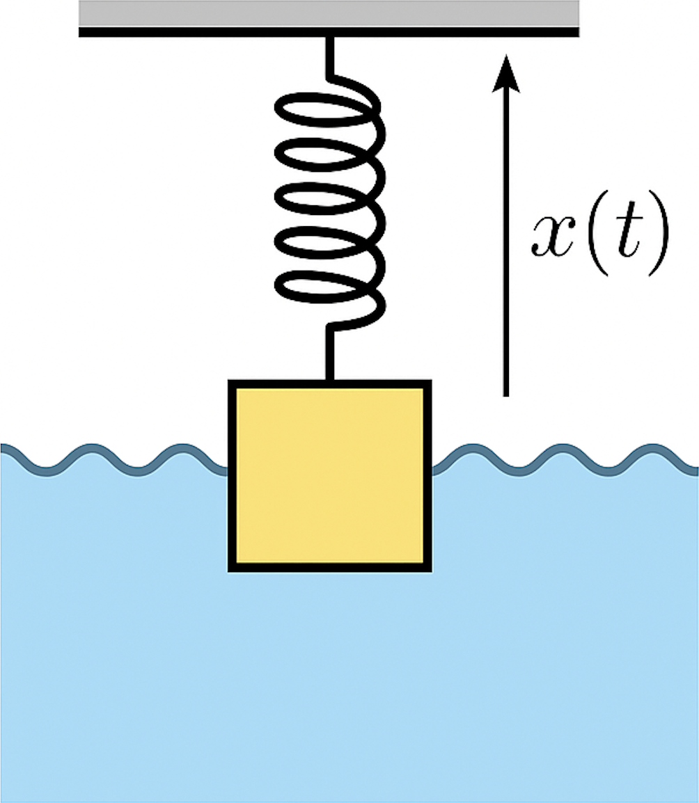
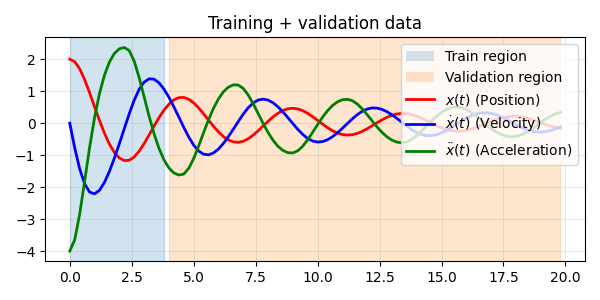
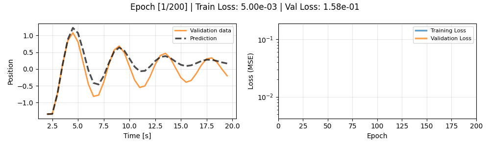
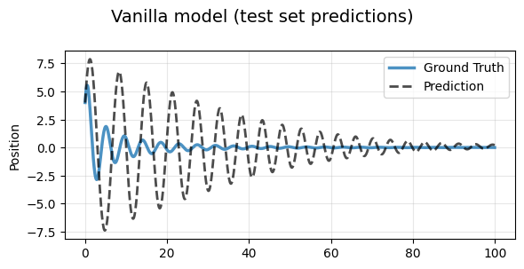
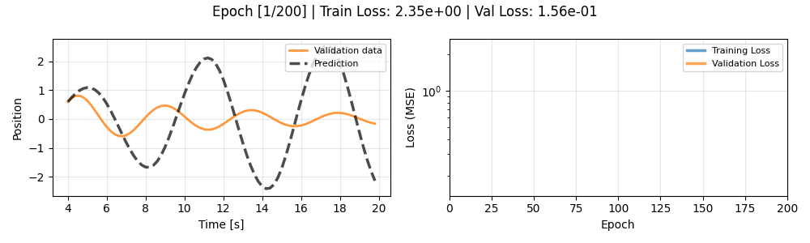
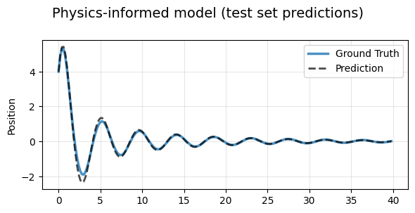

# Physics informed neural ODE demonstration

## You can run this notebook on Google collab by pressing this link: [tinyurl.com/blues-ai-workshop](https://tinyurl.com/blues-ai-workshop)


### Main Notebook
**`physics_informed_ode.ipynb`** — Complete pedagogical walkthrough demonstrating:
- **Vanilla Neural Network**: Pure data-driven baseline (poor generalization)
- **Physics-Informed Model**: Decomposes acceleration into known physics + learned residuals
- **Parameter Recovery**: Estimates spring constant $K$ and damping coefficient $C_0$ from data

### Installation

```bash
pip install -r requirements.txt
```

Run the notebook in Jupyter:
```bash
jupyter notebook physics_informed_ode.ipynb
```

## Problem:  
We have a data set that describes dampened oscillations with a nonlinear drag term, such as a mass-spring system in water. The data consists of acceleration, velocity and position measurements for one initial condition: $\{(\ddot{x}(t_i), \dot{x}(t_i), x(t_i))\}_{i=1}^N$  and is plotted below.
<p align="center">
	
	
</p>


## Method 1: Vanilla Neural ODE model (no physics):
We can model the equation by assuming no physics, and fit a neural network to a generic second order equation 

$$\ddot{x} = f{^\theta}(x, \dot{x}),$$

where $f{^\theta}$ is a neural network. We will call this the "vanilla neural ODE".

## Method 2: Physics-informed Neural ODE model:
We can assume that the governing ordinary differential equation (ODE) is of the (still rather general) form 

$$\ddot{x} = -k^\theta x + F^\theta(\dot{x}),$$

where $F^\theta$ is a neural network modelling the drag force, and $k^\theta$ is a spring constant that we can learn from the data. This yields the physics-informed model. 

## Training the neural networks
We optimise the parameters of the neural networks on the loss function 

$$L_{vanil.} = \sum_i \| \ddot{x}-f{^\theta}(x, \dot{x}) \|^2,$$

for all the $\{(\ddot{x}(t_i), \dot{x}(t_i), x(t_i))\}_{i=1}^N$ in the training data. For the physics-informed model we use: 

$$L_{phys} = \sum_i \| \ddot{x}-k^\theta x - F^\theta(\dot{x}) \|^2,$$

Below are animated GIFs showing the training loss curves and validation predictions:
### Vanilla Neural ODE model (no physics):
<p align="center">
	
	
</p>
 
### Physics-Informed Neural ODE model:
<p align="center">
	
	
</p>

Notice how the physics model achieves lower validation error and more accurate generalisation, even with limited data.
